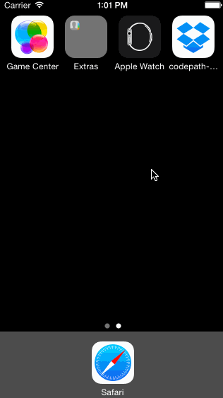

# Codepath Week 1: Dropbox

### Description:
This is a fake Dropbox iOS application that simulates account creation, sign-in, a welcome nux-flow, and zero-states for a first-time Dropbox user. The application makes use of push and modal segues.

### Time spent:
7.0 hours spent in total

### Completed user stories:
 * [x] Required: User can tap through the 3 welcome screens
 * [x] Required: User can follow the create user flow
 * [x] Required: On the create user form, the user can tap the back button to go to the page where they can sign in or create an account
 * [x] Required: Before creating the account, user can choose to read the terms of service
 * [x] Required: After creating the account, user can view the placeholders for Files, Photos, and Favorites as well as the Settings screen
 * [x] Required: User can log out from the Settings screen (create account)
 * [x] Required: User can follow the sign in flow
 * [x] Required: User can tap the area for Having trouble signing in?
 * [x] Required: User can log out from the Settings screen (sign in)
 * [x] Optional: You should be able to swipe through the welcome screens instead of just tapping them
 
### Notes:
My storyboard become a little messy when I reimplemented the automatic segues but other than that this was a fun assignment.

### Walkthrough of all user stories:

GIF created with [LiceCap](http://www.cockos.com/licecap/).

